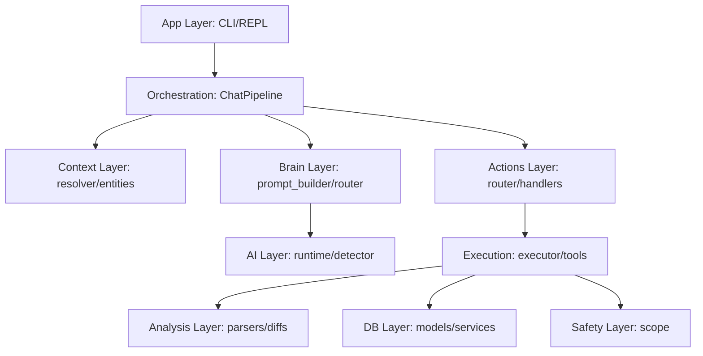

# AI Assistant Architecture Map

This document provides a comprehensive overview of the AI Assistant project's architecture, modules, and data flow.

## Project Tree Summary

```text
assistant/
├── actions/         # Action routing and execution (Body)
├── ai/              # AI provider routing and runtime (Brain connectivity)
├── analysis/        # Post-execution data processing
├── app/             # User interfaces (CLI/REPL)
├── brain/           # Reasoning, prompts, and knowledge
├── config/          # Application configuration
├── context/         # Short-term memory and entity resolution
├── db/              # Persistence layer (SQLAlchemy)
├── safety/          # Security policy and scope
├── system/          # OS and hardware interaction
├── tasks/           # Planning and task state
├── tools/           # Tool discovery and execution bridge
├── utils/           # Shared helpers
└── workspace/       # File and session organization
```

## Layer Diagram



## File Responsibility Table

| Module | File | Purpose | Main Classes/Functions | Status |
| :--- | :--- | :--- | :--- | :--- |
| **App** | `app/cli.py` | CLI Entry Point | `cli()` group | Active |
| **App** | `app/terminal/repl.py` | Main Interactive Loop | `run_repl()`, `InteractiveREPL` | Active |
| **App** | `app/terminal/pipeline.py` | Chat Orchestrator | `ChatPipeline.process()` | Active |
| **Actions** | `actions/router.py` | Route actions | `ActionRouter.route()` | Active |
| **Actions** | `actions/executor.py` | Execute plans | `Executor.execute_plan()` | Active |
| **AI** | `ai/router.py` | Model Routing | `AIRouter` | Active |
| **AI** | `ai/runtime.py` | Model State | `AIRuntime` | Active |
| **Brain** | `brain/prompt_builder.py` | System Prompts | `PromptBuilder` | Active |
| **Tasks** | `tasks/planner.py` | Plan Generation | `Planner.create_plan()` | Active |
| **Context** | `context/resolver.py` | Pronoun Resolution | `ContextResolver` | Active |
| **Tools** | `tools/runner.py` | Subprocess Bridge | `ToolRunner` | Active |
| **Safety** | `safety/scope.py` | Security Boundary | `ScopeManager` | Active |
| **DB** | `db/models.py` | Schema Definitions | `Task`, `TaskStep`, `Message` | Active |

## Duplicate & Overlap Report

| Original | Duplicate/Overlap | Issue | Recommendation |
| :--- | :--- | :--- | :--- |
| `app/terminal/repl.py` | `app/repl.py` | `app/repl.py` is empty (0 bytes). | Delete `app/repl.py`. |
| `actions/executor.py` | `tasks/executor.py` | `tasks/executor.py` is empty (0 bytes). | Delete `tasks/executor.py`. |
| `context/` | `brain/context_manager.py` | Functional overlap in entity extraction. | Deprecate `brain/context_manager.py`. |
| `system/discovery.py` | `system/os_detect.py` | `discovery.py` imports `os_detect.py`. | Keep as is (helper pattern). |
| `app/terminal/repl.py` | `app/terminal/tui.py` | TUI is experimental/unused. | Move to `experimental/` or delete. |

## Dead & Experimental Code

- `assistant/app/repl.py`: Empty file.
- `assistant/tasks/executor.py`: Empty file (logic moved to `actions/`).
- `assistant/app/terminal/tui.py`: Rich-based TUI that is currently bypassed by the standard REPL.
- `assistant/brain/knowledge.py`: Partial RAG implementation, not fully integrated into pipeline.

## Missing Links & Architecture Violations

1.  **Violation**: Internal reasoning JSON is sometimes returned as content if the AI doesn't provide a `content` field.
2.  **Violation**: `REPL` directly initializes `Executor`. It should probably go through the `ActionRouter`.
3.  **Missing Link**: `security_scan` and `safe_local_command` intents in the `ActionRouter` currently just signal `needs_pipeline` instead of triggering the `Executor` directly.

## Cleanup Plan

1.  **Phase 1**: Remove all 0-byte files (`app/repl.py`, `tasks/executor.py`).
2.  **Phase 2**: Consolidate `brain/context_manager.py` into `context/resolver.py`.
3.  **Phase 3**: Move `app/terminal/tui.py` to an `experimental/` folder.
4.  **Phase 4**: Ensure all execution (even multi-step) is initiated via `ActionRouter`.
